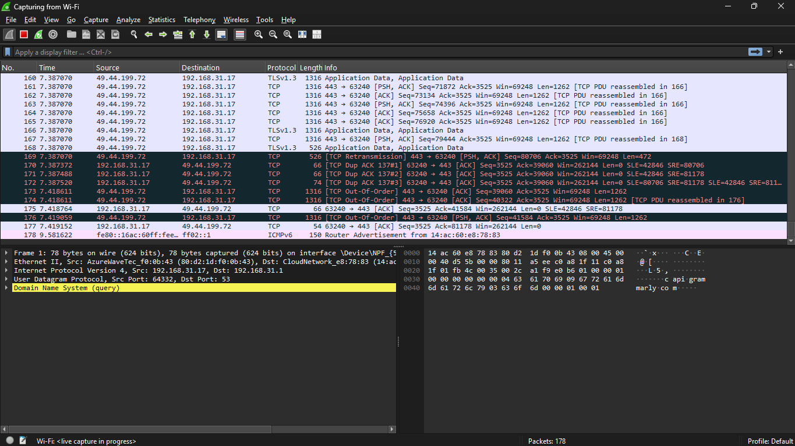
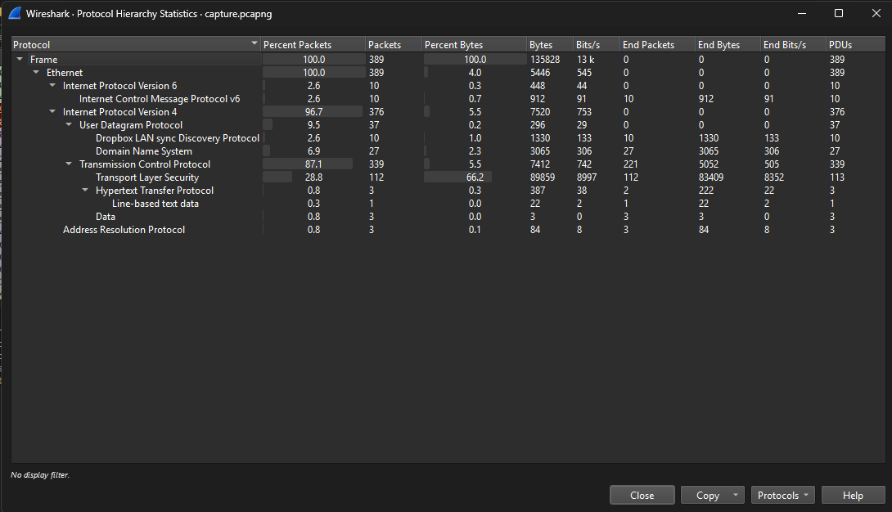

# Network Traffic Analysis Report

## Installation Guide

### Installing Wireshark on Windows:

1. Visit the official [Wireshark website](https://www.wireshark.org/download.html).
2. Download the Windows installer.
3. Run the installer and follow the setup wizard.
4. During installation, install **WinPcap** or **Npcap** when prompted (used for packet capture).
5. Launch Wireshark after installation.

## Wireshark Interface Overview

 

 Shows all active network interfaces.

## Start Capture

 -  Select an interface and click the shark fin icon to begin capturing.
   
   

 - After capturing, click the red square on the toolbar to stop the capture.
 - Go to File > Save As (or press Ctrl + S).
 - Choose the destination folder and give your file a name, e.g., capture.pcapng.
 - Select the file format:
    .pcapng (default, recommended)
     or .pcap (older format, still compatible)
 - Click Save.

Here's my captured file:

[View](/capture.pcapng)

## My Findings

 I used various techniques to analyze the packet and extract most of the information from it. Here's a breakdown:

 1. Protocol Hierarchy Observed

    

    Wireshark’s protocol hierarchy (visible via `Statistics > Protocol Hierarchy`) showed the following types:
    
    - **Ethernet II**
    - **IPv4**
    - **TCP**
    - **UDP**
    - **HTTP**
    - **DNS**
    - **Dropbox LAN Sync Protocol (DB-LSP)**
 
